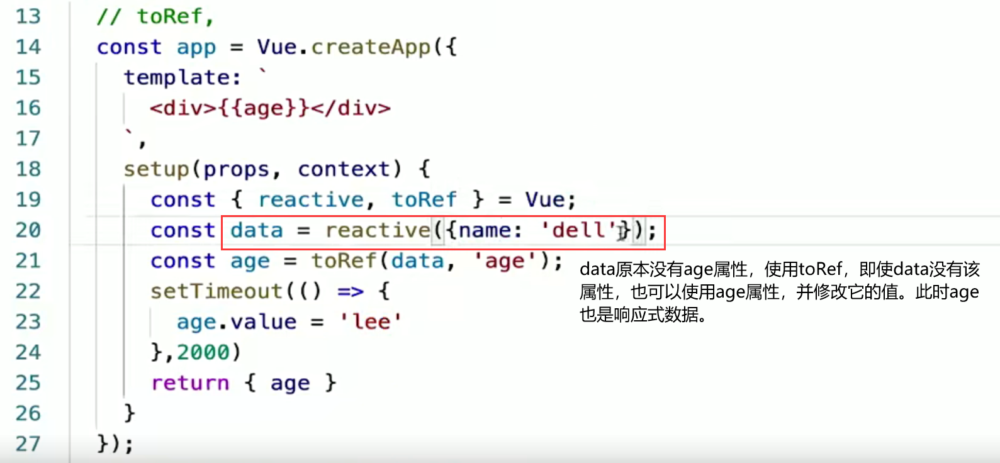

# 一 创建项目

1.yarn create @vitejs/app manager-fe

如果出现报错，就换成：yarn create vite


注意：使用yarn命令，yarn必须是全局安装。如果不是全局安装，根据以下步骤修改：


根据第二个命令行知道yarn的安装路径，再设置 yarn 的全局安装路径和缓存路径

```
yarn config set global-folder "D:\Application\node\yarn\global"
yarn config set cache-folder "D:\Application\node\yarn\cache"

```

# 二 安装插件

yarn add vue-router@next vuex@next element-plus axios -S

yarn add sass -D

# 三 vite获取环境变量

1. console.log('环境变量=>'import.meta.env)
2. vue创建的项目：.process.env

# 四 路由跳转

1. router-link

2. this.$router.push

3. vue3

   ```
   let router = useRouter()
   router.push()
   ```

--注意：vite创建的vue3项目，导入组件时一定需要写后缀名

# 五 Composition API

1. ref：普通类型。响应式引用

2. reactive：复杂型。响应式引用

3. readonly：只读

4. toRefs：将对象里的属性解构成`响应式`普通类型的数据

5. toRef：

   

6. computed：

   

7. watch：存在惰性执行；

   

   将watch改为非惰性执行：添加一个参数

   

8. watchEffect：立即执行；不需要传递侦听的内容，自动感知代码依赖，只需要传递一个回调函数；只能获取最新数据的值

   

9. 取消侦听器

   

10. 获取dom节点

    
